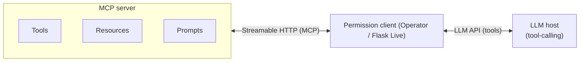
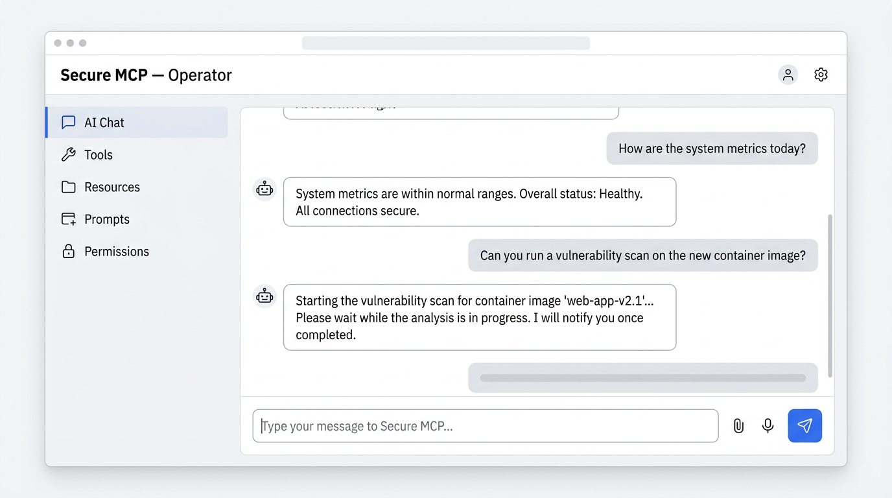
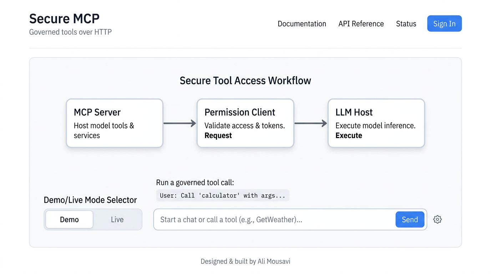

# Secure agentic tools (MCP, HTTP)

**Governed MCP over streamable HTTP** — not a thin chatbot wrapper. This project wires a **FastMCP** server, a **permission-aware client** (`allow` / `ask` / `deny` + audit), and a **tool-calling LLM host** (Operator **Gradio** + Flask **Demo / Live**; model is pluggable).

**Author:** [Ali Mousavi](https://github.com/alialoha) · **Repository:** [github.com/alialoha/secure-agentic-mcp](https://github.com/alialoha/secure-agentic-mcp)

## Architecture (at a glance)



- **Server** — MCP **server** role: tools, resources, prompts; workspace + server-side audit.
- **Middle** — MCP **client** (streamable HTTP to the server) plus **app policy**: `permissions.json` and `audit.log` live on the client; Operator / Flask are the UIs that embed this stack.
- **LLM** — **Tool-calling** over an **LLM API** (not MCP transport); the concrete model is a deployment choice. The model proposes tools; **policy runs in the client** before calls reach the MCP server.

## Screenshots

Representative UI captures for reviewers (replace with your own if you prefer pixel-perfect fidelity to a local run).

| Operator (Gradio) — `python -m mcp_operator.gradio_app` | User UI (Flask) — `python -m web.app` |
| --- | --- |
|  |  |

## Layout

All Python packages live under **`src/`** only. (Do not add `mcp_client`, `mcp_server`, or `operator` at the repo root — those were stray empty folders and have been removed.)

- `src/mcp_server` — merged workspace + governance tools, audit log, resources, prompts; serves **`/mcp`** over streamable HTTP.
- `src/mcp_client` — streamable HTTP client + `data/permissions.json` policy + client audit log.
- `src/agent` — LLM tool-calling host (OpenAI-compatible: OpenAI, Groq, Cerebras, custom `OPENAI_BASE_URL`; shared by Operator and Flask Live).
- `src/mcp_operator` — Gradio: AI chat, tool/resource/prompt inspection, permission editor.
- `src/web` — Flask user app: **Demo** (offline) or **Live** (LLM + MCP).
- `data/` — `permissions.json`, `workspace/`, generated `audit.log`.

### Repository tree

```
secure-agentic-mcp/
├── README.md
├── docs/
│   ├── operator.png
│   └── flask.png
├── requirements.txt
├── docker-compose.yml
├── Dockerfile.server
├── Dockerfile.operator
├── Dockerfile.web
├── .env.example
├── .gitignore
├── pytest.ini
├── data/
│   ├── permissions.json
│   └── workspace/
│       └── README.md
└── src/
    ├── agent/
    │   ├── __init__.py
    │   ├── llm_client.py
    │   └── mcp_llm_host.py
    ├── mcp_client/
    │   ├── __init__.py
    │   └── http_permission_client.py
    ├── mcp_operator/
    │   ├── __init__.py
    │   └── gradio_app.py
    ├── mcp_server/
    │   ├── __init__.py
    │   ├── __main__.py
    │   └── server.py
    └── web/
        ├── __init__.py
        ├── app.py
        ├── demo.py
        ├── branding.py
        ├── static/
        │   ├── architecture.svg
        │   ├── script.js
        │   └── styles.css
        └── templates/
            └── index.html
└── tests/
    ├── test_agent.py
    ├── test_demo.py
    ├── test_flask.py
    ├── test_imports.py
    └── test_permission_client.py
```

Local-only (not in git): `.env`, `.venv/`, `data/audit.log`, `.pytest_cache/`.

## Quick start (local)

```bash
cd secure-agentic-mcp
python -m venv .venv
.venv\Scripts\activate   # Windows
pip install -r requirements.txt
copy .env.example .env   # add LLM credentials (OpenAI, Groq, Cerebras, or custom URL — see comments)
```

Terminal 1 — MCP server:

```bash
set PYTHONPATH=src
set MCP_DATA_DIR=%CD%\data
python -m mcp_server
```

Terminal 2 — Operator (Gradio):

```bash
set PYTHONPATH=src
set MCP_SERVER_URL=http://127.0.0.1:8000
set MCP_DATA_DIR=%CD%\data
python -m mcp_operator.gradio_app
```

Terminal 3 — User Flask app:

```bash
set PYTHONPATH=src
set MCP_SERVER_URL=http://127.0.0.1:8000
set MCP_DATA_DIR=%CD%\data
python -m web.app
```

- MCP: `http://127.0.0.1:8000/mcp`
- Operator: `http://127.0.0.1:7860`
- User UI: `http://127.0.0.1:5000`

### Windows: numbered scripts (same steps, one terminal per app)

From the repo root: `.\scripts\00-print-env.ps1` (preview only), then `01-mcp-server.ps1`, `02-operator.ps1`, `03-web.ps1`. See `scripts\RUN-ORDER.txt` and the comments at the top of each `.ps1` file.

## Docker

```bash
copy .env.example .env
docker compose up --build
```

Maps: MCP `8000`, Operator `7860`, Web `5000`. Set LLM credentials in `.env` (default `LLM_PROVIDER=openai` + `OPENAI_API_KEY`, or `groq` / `cerebras` / `custom` — see `.env.example` and [free-llm-apis](https://github.com/vossenwout/free-llm-apis)).

## Environment

See `.env.example`. Important: `MCP_SERVER_URL` (must match Docker service `http://mcp:8000` inside Compose), `MCP_DATA_DIR`, and `LLM_PROVIDER` with the matching keys (`OPENAI_API_KEY`, `GROQ_API_KEY`, `CEREBRAS_API_KEY`, or `OPENAI_BASE_URL` + `OPENAI_API_KEY` for custom). Free-tier setup ideas: [free-llm-apis](https://github.com/vossenwout/free-llm-apis).

## Troubleshooting

**`list_files` / `read_file` don’t match `data/workspace/` on disk**

Only **one** process should listen on the URL you set in `MCP_SERVER_URL` (default `http://127.0.0.1:8000`). If another MCP server (for example another project) grabbed that port first, Gradio/Flask will talk to **that** server’s workspace, not this repo’s `data/workspace/`.

- Stop other MCP servers, or set **`MCP_HTTP_PORT`** / **`MCP_SERVER_URL`** so they don’t share a port (e.g. `8010` and `http://127.0.0.1:8010`).
- When you start **`python -m mcp_server`**, check the console: it prints **`MCP_DATA_DIR`** and **`Workspace`** absolute paths for **this** repo. They must match where you look for files.

**Background terminals (Cursor)**

Use **View → Terminal** (or `` Ctrl+` ``). Each tab is a shell; long-running servers run there. On Windows, `netstat -ano | findstr :8000` shows which **PID** owns a port.

## Tests

Automated tests use **pytest** (`pytest.ini` sets `pythonpath = src`). They do **not** start the MCP HTTP server or call external APIs.

```bash
pip install -r requirements.txt
pytest -v
```

| Step | What it checks |
|------|----------------|
| Imports | `mcp_server`, `mcp_client`, `agent`, `mcp_operator`, `web` load |
| `demo_reply` | Offline demo strings |
| Permission client | Load/save JSON policy, `check_permission`, defaults |
| `risk_levels_map` | All expected tool names present |
| `llm_client` | Provider defaults, `resolved_llm_model`, `live_llm_configured` |
| Flask | `GET /`, `POST /generate` demo mode, validation error |

For manual end-to-end checks, run the three processes from [Quick start (local)](#quick-start-local) and exercise Operator + Live mode in the browser.
